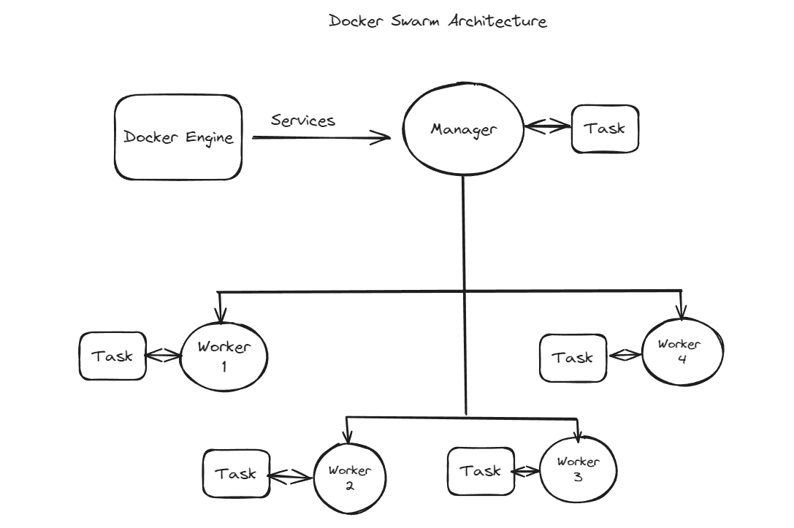

# Docker Swarm

## Container Orchestration 
-  Container Orchestration is the process of deploying and maintaining large number of containers and services for the application to run as intended.
- It is difficult to maintain and monitor different containers for different services. For ex. We have a utility that contains n number of files for different purpose as different file for broker, publisher, receiver, sending data to influxdB and receiving data from the same database. 
- There will be different containers for different services and it becomes a very tedious task to operate and manage different containers, thats when container orchestration comes into place.
- Container orchestration is performed to control and automate tasks such as:
    - Deployment of Containers
    - Scaling 
    - Resource Allocation 
    - Load Balancing
    - Health Monitoring and much more....

## What is Docker Swarn
- Docker Swarn is a container orchestration tool part of the Docker Engine which is used to deploy and manage a cluster or a group of Docker nodes as a single virtual system.
- 

